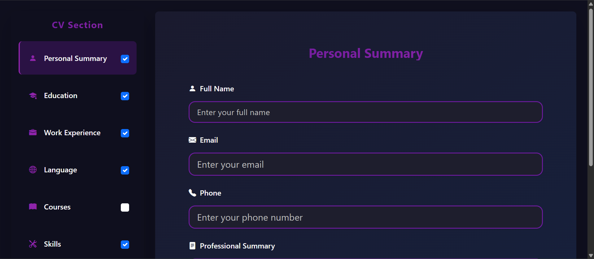
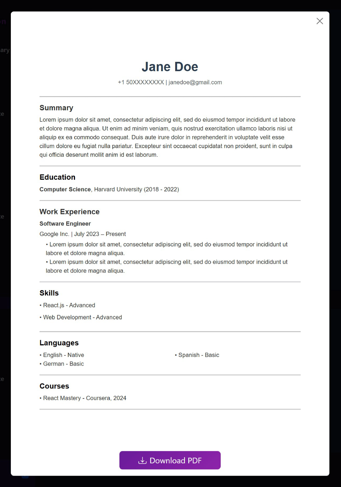

# CV Builder

A simple React-based web application to create and customize a professional CV (resume). This project allows users to input personal details, education, work experience, languages, courses, and skills, with options to preview and download the CV as a PDF.

## Features
- Add and edit personal summary, education, work experience, languages, courses, and skills.
- Toggle sections to include/exclude in the CV preview.
- Real-time preview of the CV layout.
- Download CV as a PDF file.

## Technologies Used
- **React**: For building the user interface.
- **Bootstrap**: For styling and responsive design.
- **jsPDF & html2canvas**: For generating PDF downloads.
- **React Icons**: For icons in the UI.

## Installation

1. **Clone the repository**:
   ```bash
   git clone https://github.com/arianz/cv-builder.git
   ```
2. Navigate to the project directory:
   ```bash
   cd cv-builder
   ```
3. Ensure you have Node.js installed, then install dependencies:
   ```bash
   npm install
   ```
4. Start the development server:
   ```bash
   npm start
   ```

## Screenshots
|          App Interface - Desktop         |          App Interface - Mobile          |
|------------------------------------------|------------------------------------------|
|  |  |

|          Preview CV              |
|----------------------------------|
|  |
